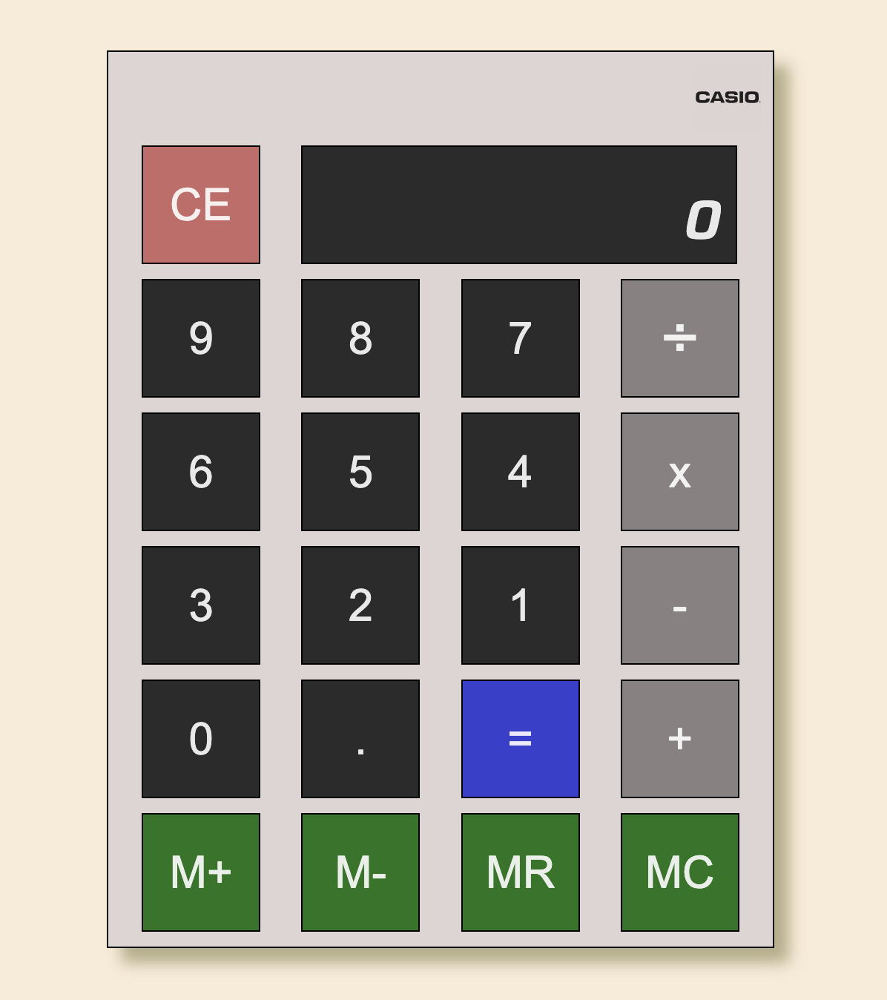

# calculator_app

A Calculator Application.

Languages Used:  HTML / CSS / JavaScript

View the application [here](https://jmurrii.github.io/calculator_app/)

## Summary
In the Sixth exercise of Andy Sterkowitz' Software Development Mastermind Program, I was given the task of creating a calculator application.
To complete the task I had to get comfortable with using the event.target attribute so that I could store data dynamically.
User date also had to be stored over time so that the calculations could be carried out.
I used Javascript to build this application.

## Author
John Murray - _Software Developer_

[LinkedIn](https://www.linkedin.com/in/jmurrii/)

